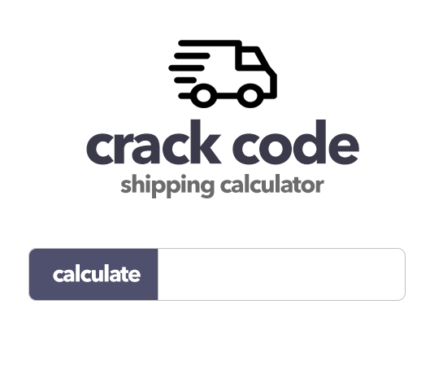

# Let's Get Packing
HTML  CSS and JS make friends together in the Crack Code shipping calculator.  
This is a walk through exercise where we will build our first UI  element taking a look at HTML best practices and a deeper look at styling. We end this class with hooking up our first simple JavaScript file and take a look at the script output in the browser console.
 
 

  
   
   

## __Side Topics__
:cool::poop:Sourcing Svg Icons.  
:cool::poop:Browser Dev Tools  
:cool::poop:Deeper Dive Into CSS UI Layout  
:cool::poop:Markuping Up UI with HTML with Style Hooks